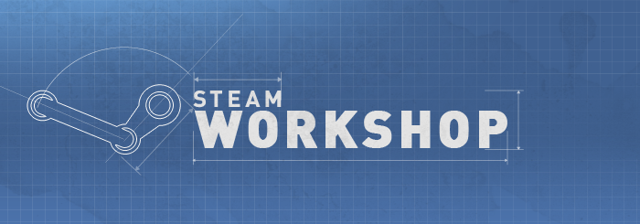
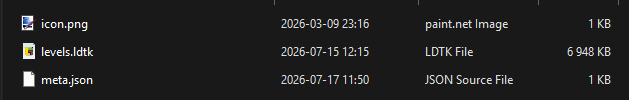
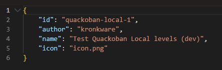

I've made some good progress on Quackoban in the past few months, after a small hiatus in the early summer.

The first main focus I had was to add Steam Workshop support to the game, which I think is going to be a critical feature for the game, as it will allow players to create and share their own levels with the community.

# What is Steam Workshop?

[Steam Workshop](https://steamcommunity.com/workshop/) is a platform provided by Valve that allows players to create, share, and download user-generated content for games. By integrating Steam Workshop into Quackoban, players will hopefully be able to share their custom levels with the community and discover new levels created by others.

# Why add Steam Workshop support?

Well, adding Steam Workshop support to Quackoban is something that I think will greatly enhance the game's replayability and engagement.

By allowing players to create and share their own level packs, it should become possible for people to express their creativity and challenge others with their own unique puzzles. I am hoping that this will lead to _some kind of thriving community_ around the game! And if not, at least it will give players a potential reason to keep coming back to the game, as there will always be new levels to try out, in a faster pace than I can create them myself.

I also want to emphasize that I think there are some great puzzle designers out there that might not have the time or resources to create their own game, but they might be able to create some really interesting levels for games like Quackoban. This is a way for them to get their work out there and have it played by others, which I think is really cool.

# What kind of support have I added?

"Steam Workshop support" doesn't say much by itself, so let's try to be clear about what I've added:

- The ability for players to upload and update their own level packs to Steam Workshop
- The ability for players to play any level pack that you have subscribed to from Steam Workshop

I haven't added an in-game browser of the workshop unfortunately, with the hope that the one provided by Steam itself should be sufficient.

If it turns out that players really want an in-game browser, I might add that later.

# What does it look like to create and upload a level pack?

I figured this might be useful to anyone who is interested in how I've decided to handle this, so here's a quick overview of how level packs work in Quackoban.

## The level pack management UI in-game

The **Official** tab has all the official level packs that I have created and released. This tab doesn't allow you to do much, other than view the level packs that are available.

The **Local** tab will have all the level packs that you have created and saved locally on your computer in `%AppData%/Roaming/Quackoban/content-packs` (including those that you have published to Steam Workshop). This tab has buttons for reloading from disk, opening the corresponding level pack folder, and uploading/updating a level pack on the Steam Workshop.

The **Steam Workshop** tab is (you guessed it) where you can see all the level packs that you have subscribed to from Steam Workshop. This also has a reload button, which will check for newly subscribed level packs.

## What does a level pack consist of?

A level pack is quite simply a folder with the following content:

### meta.json

A `meta.json` file that contains the level pack's metadata, such as its name, description, and author. Below is an example:

### icon.png

This is just the icon that appears in the level pack management UI, and is also used as the thumbnail for the level pack on Steam Workshop by default. A 16x16px .png is required. It does not need to be called `icon.png`, it just needs to correspond to the name specified in the `meta.json` file.

### levels.ldtk

This is the actual level data file, which is created and edited using [LDtk](https://ldtk.io/). This file contains all the levels in the level pack, as well as their layout and properties. The file does not have to be called `levels.ldtk`, but it does need to have the `.ldtk` extension, and there can only be one `.ldtk` file per level pack.

I'll be writing a separate post about how to make your own actual levels for Quackoban with LDtk in the future, so no more details for now - but stay tuned for that!

## Once you've got that, how do you play your level pack?

It's quite simple really! You place the level pack folder in `%AppData%/Roaming/Quackoban/content-packs`, and then you can reload the level packs in the game, and your level pack _should_ appear in the **Local** tab.

Then all you have to do is create a new save and select your level pack from the list of available level packs! Easy!

## How do you upload your level pack to Steam Workshop?

Also, quite simple! Once you've got your level pack ready and in your local level packs folder, you can click the **"Publish to Steam Workshop"** button in the **Local** tab of the level pack management UI. This will create a _private_ Steam Workshop item for your level pack, which you can then edit and make public in Steam itself.

It'll have a default thumbnail, but you can modify that and other things to your heart's content in the Workshop item editor on Steam. Once you're happy, just make it public and then anyone can subscribe to your level pack and play it in Quackoban!

If you want to make changes to your level pack after you've published it, you can just update the level pack in your local folder and then click the **"Publish update to Steam Workshop"** button in the **Local** tab. This will update the existing Steam Workshop item with your file changes.

# Finishing up

One of the reasons I have played a lot of other certain puzzle games has been the ability to both create and play other people's own levels. It's a great way to keep a game fresh and interesting, and I hope that by adding Steam Workshop support to Quackoban, it will have a similar effect on the game!

I am very excited to see what kind of levels people will create and share with the community!

Oh and I just dropped a [small patch to the Quackoban Demo](https://store.steampowered.com/news/app/4444330/view/675127185664642051) with a few resolution improvements and other stuff! Make sure to check out the demo if you haven't already, and wishlist the game to be notified when it's released!



## Quick shoutout to Shifty!

I was lucky enough to get a livestreamed playthrough of the Quackoban Demo by [@shiftygamedev](https://www.twitch.tv/shiftygamedev), and it was really fun to watch! Shifty offers to playtest games for developers, and I highly recommend checking out his Twitch channel if you're interested in game development and want to see some fun playthroughs of in-development indie games.

He was (fortunately _and_ unfortunately) the one to identify some of the resolution issues that I have since fixed in the latest patch, so I am very grateful for that. He also highlighted some other things that I will be looking into for future updates, so I am very thankful for his time and feedback! Thanks Shifty!

That's it for now, quack quack!
