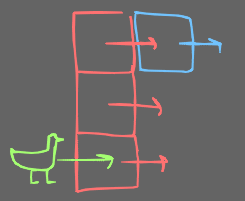
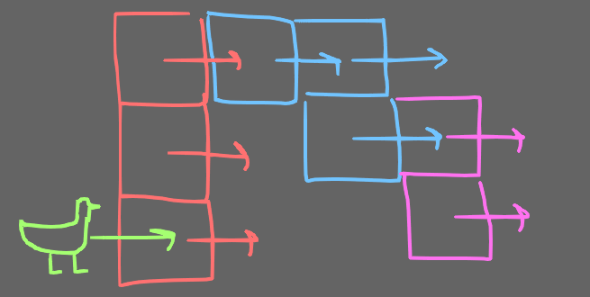
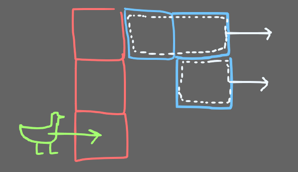
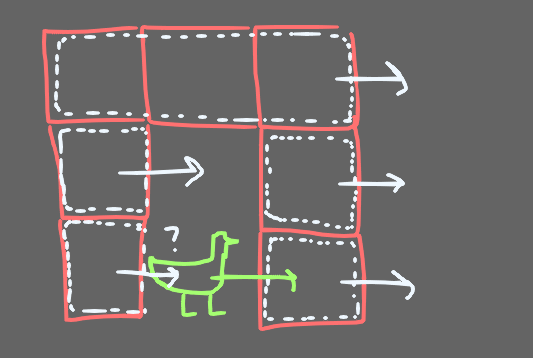

So back in October 2024, I started working on a new project. I haven't posted anything in a while, so I figured that I could share the progress I've made so far - going over the initial prototype, what some of the challenges have been this far, and what I plan to do next.

# What's the game?

The game is supposed to be a [sokoban](https://en.wikipedia.org/wiki/Sokoban)-like puzzle game. You control a duck that can push boxes around a grid-based map, where the goal is to push boxes into their designated spots. **But wait, there's more**! The idea is to incorporate a bunch of different mechanics that make the otherwise simple box-pushing gameplay more interesting. The main mechanic that most other mechanics will build on is that boxes of the same color _stick_ together and then move as a single _unit_ (remember that word).

Anyway, this was the prototype of the game that I threw together in a few days to see if the idea was worth pursuing:



As is evident from the video, the gameplay is _riveting_ and the graphics are _stunning_. Oh, and the video cuts out right before the win condition is met because it just immediately restarts the level, which is a bit annoying. But hey, it was just a prototype!

You'll see what the game currently looks like later in this post, but first, let's go over some of the major challenges (or frustrations) I've faced with this project so far.

# The frustration that is _"boxes of the same color stick together"_

Right, so the main twist of the game is that boxes of the same color stick together and move as a single unit. You'd think that it wouldn't be that hard to implement, but it turned out to be a bit of a nightmare. I've later also learned that the famous [Arvi "Hempuli" Teikari](https://www.hempuli.com/) initially had an idea for a [similar mechanic](<https://babaiswiki.fandom.com/wiki/STICK_(Property)>) in his game [Baba Is You](https://hempuli.com/baba/), but ultimately decided against it because of ["nightmare programming problems"](https://youtu.be/7zLwa4bztWs?si=ZZ_vTEGcDr4ZrrP9&t=816). I was in for a ride, that's for sure.

Anyway, the main issue with this mechanic is that it must become the _de facto_ way to move boxes around the grid. A single box must be considered a _unit_, just as much as a _unit_ of 12 boxes, regardless of shape. Let's take a look at a few different scenarios to illustrate the problem.

### Recursive box pushing



In this scenario, the duck is pushing a red unit consisting of 3 boxes stacked vertically. Pushing that unit should push the blue box in front of it, for it to make sense. Getting this to work doesn't look too hard does it? All that's required is that we:

1: Traverse grid to find entire unit of boxes that is being pushed.

2: Attempt to move each box in the unit in the direction of the push.

3: If all boxes in the unit can be moved, then move the entire unit.

But it should be relatively clear that step 2 is not as simple as it seems. What if there is a box in the way of one of the boxes in the unit (like in the example image)? We can't just say that the entire unit can't be moved, because that would mean that the blue box wouldn't be pushed either. So we need to also check if the box in the way can be moved, and if it can, then that needs to move as well.



What if we keep adding boxes/units in the way of the box being pushed? We need to keep checking if the boxes in the way can be moved. We need _recursion_ to solve this problem. Let's look at some untested Python for how this could be implemented:

```python
def push_unit(unit, direction):
  resulting_pushes = []

  for box in unit:
    position_after_push = (box.x + direction.dx, box.y + direction.dy)
    unit_at_push = get_unit_at_position(position_after_push)

    if unit_at_push is None:
      resulting_pushes.append((box, position_after_push))
      continue

    pushed_unit, success = push_unit(unit_at_push, direction)
    if success:
      resulting_pushes.extend(pushed_unit)
      resulting_pushes.append((box, position_after_push))
    else:
      return [], False

  return resulting_pushes, True
```

I mean, that doesn't look too bad right? The problem is that this isn't going to suffice even for the scenario in the previous image. Attempting to push a unit along one of its axes will result in infinite recursion. Consider the left most blue box in the image above. Attempting to push it along the x-axis will result in it seeing that there is a unit (its own blue unit) at the position it is being pushed to, which will start the same `push_unit` routine for the exact same unit again.

I managed to solve this problem by breaking down each unit into its own push-direction-aligned _lines_. So pushing a unit along the x-axis will break the unit down into its x-axis aligned lines, and pushing along the y-axis will break it down into its y-axis aligned lines.



By doing this, we can iterate over all the lines in the unit rather than all of its boxes. Pushing a line is actually a lot simpler, since it is only the front-most box in the line that needs to perform any kind of checking. The front-most box will check if there is a box in the way, and if there is, it will push that box (and its unit) recursively. If the front-most box can be pushed, then the entire line can be pushed, and if all lines in the unit can be pushed, then the entire unit can be pushed.

But we are still not done it seems...



In the above image, if the duck pushes the red unit to the right, the red unit will attempt to push the duck, which will attempt to push the red unit, and so on. Yet another infinite recursion problem.

I solved this by keeping a local grid that doesn't contain the currently pushing unit in the `push_unit` routine. That way, the red unit will not see the duck as a box that it can push, and we can avoid the infinite recursion.

Let's take a look at even more untested code for the `push_unit` routine with the push-direction-aligned lines and the local grid:

```python
def push_unit(grid, unit, direction):
  resulting_pushes = []
  unit_lines = get_unit_lines(unit, direction)
  local_grid_without_unit = remove_unit_from_grid(copy_grid(grid), unit)

  for line in unit_lines:
    front_box = get_front_of_line(line, direction)

    position_after_push =
      (front_box.x + direction.dx, front_box.y + direction.dy)

    # Passing the local grid without the pushing unit
    # prevents it from seeing the currently pushing unit
    unit_at_push = get_unit_at_position(
      local_grid_without_unit, position_after_push)

    if unit_at_push is None:
      resulting_pushes.extend(move_line(line, direction))
      continue

    pushed_unit, success = push_unit(
      local_grid_without_unit, unit_at_push, direction)
    if success:
      resulting_pushes.extend(pushed_unit)
      resulting_pushes.extend(move_line(line, direction))
    else:
      return [], False

  return resulting_pushes, True
```

Now, while I haven't written this game in Python, the same logic still applies to the actual C# code that I wrote. I'm sure this from-the-top-of-my-head-written Python doesn't even cover many of the edge cases that I had to deal with, but it should give you an idea of the complexity of the problem.

This becomes the basis upon all movement in the game, so it is crucial that it works correctly, and can handle all the edge cases that I throw at it - it is a puzzle game after all.

# Show me the game!

Alright, alright, enough with the boring technical details. Here's what the game currently looks like (many iterations later of the same level shown in the prototype video):



As you can see, the game has come quite a way since the initial prototype. The graphics are still very much a work in progress, but the gameplay is starting to take shape.

# What's the plan?

The plan is to continue developing the game, adding more levels, mechanics, and polish. I aim to release later this year, but that might change. I want to make sure that the game is fun and challenging, and that it has a good variety of levels and mechanics to keep players engaged.

Due to the nature of the game, I don't want to spoil too many of the mechanics or levels that I already have implemented, or am planning to implement. But! I do plan on making some more posts about the game in the future, going over some of the mechanics, how I make levels, and maybe even some of the technical details of the game engine itself. So stay tuned for that!

Oh, and if you're interested in being part of a playtest, feel free to reach out to me. I regularly let people playtest the game to see what they think of mechanics, levels and the overall gameplay. There's an `e-mail contact` button in the footer of the site - hit me up there and I'll get back to you as soon as I can.
